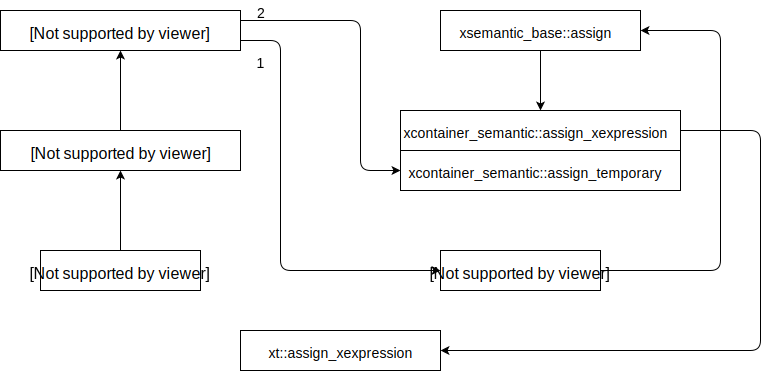
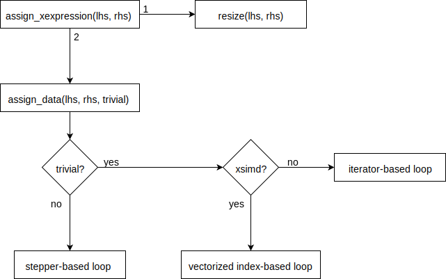
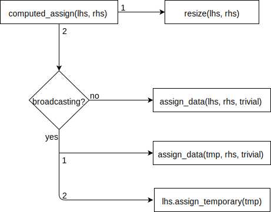

.. Copyright (c) 2016, Johan Mabille, Sylvain Corlay and Wolf Vollprecht

   Distributed under the terms of the BSD 3-Clause License.

   The full license is in the file LICENSE, distributed with this software.

.. _xtensor-assign-label:

Assignment
==========

In this section, we consider the class ``xarray`` and its semantic bases (``xcontainer_semantic`` and
``xsemantic_base``) to illustrate how the assignment works. `xtensor` provides different mechanics of
assignment depending on the type of expression.

Extended copy semantic
~~~~~~~~~~~~~~~~~~~~~~

``xarray`` provides an extended copy constructor and an extended assignment operator:

.. code::

    template <class E>
    xarray(const xexpression<E>&);

    template <class E>
    self_type& operator=(const xexpression<E>& e);

The assignment operator forwards to ``xsemantic_base::operator=`` whose implementation is given below:

.. code::

    template <class E>
    derived_type& operator=(const xexpression<E>& e)
    {
        temporary_type tmp(e);
        return this->derived_cast().assign_temporary(std::move(tmp));
    }

Here ``temporary_type`` is ``xarray``, the assignment operator computes the result of the expression in
a temporary variable and then assigns it to the ``xarray`` instance. This temporary variable avoids aliasing
when the array is involved in the rhs expression where broadcasting happens:

.. code::

    xarray<double> a = {1, 2, 3, 4};
    xarray<double> b = {{1, 2, 3, 4},
                        {5, 6, 7, 8}};
    a = a + b;

The extended copy constructor calls ``xsemantic_base::assign`` which calls ``xcontainer::assign_xexpression``.
This two-steps invocation allows to provide an uniform API (assign, plus_assign, minus_assign, etc) in the
top base class while specializing the implementations in inheriting classes (``xcontainer_semantic`` and
``xview_semantic``). ``xcontainer::assign_xexpression`` eventually calls the free function ``xt::assign_xexpression``
which will be discussed in details later.

The behavior of the extended copy semantic can be summarized with the following diagram:

Computed assignment
~~~~~~~~~~~~~~~~~~~

Computed assignment can be achieved either with traditional operators (``operator+=``, ``operator-=``) or
with the corresponding assign functions (``plus_assign``, ``minus_assign``, etc). The computed assignment
operators forwards to the extended assignment operator as illustrated below:

.. code::

    template <class D>
    template <class E>
    inline auto xsemantic_base<D>::operator+=(const xexpression<E>& e) -> derived_type&
    {
        return operator=(this->derived_cast() + e.derived_cast());
    }

The computed assign functions, like ``assign`` itself, avoid the instantiation of a temporary variable.
They call the overload of ``computed_assign`` which, in the case of ``xcontainer_semantic``, simply forwards
to the free function ``xt::computed_assign``:

.. code::

    template <class D>
    template <class E>
    inline auto xsemantic_base<D>::plus_assign(const xexpression<E>& e) -> derived_type&
    {
        return this->derived_cast().computed_assign(this->derived_cast() + e.derived_cast());
    }

    template <class D>
    template <class E>
    inline auto xcontainer_semantic<D>::computed_assign(const xexpression<E>& e) -> derived_type&
    {
        xt::computed_assign(*this, e);
        return this->derived_cast();
    }

Again this two-steps invocation allows to provide a uniform API in ``xsemantic_base`` and specializations
in the inheriting semantic classes. Besides this allows some code factorization since the assignment
logic is implemented only once in ``xt::computed_assign``.

Scalar computed assignment
~~~~~~~~~~~~~~~~~~~~~~~~~~

Computed assignment operators involving a scalar are similar to computed assign methods:

.. code::

    template <class D>
    template <class E>
    inline auto xsemantic_base<D>::operator+=(const E& e) -> disable_xexpression<E, derived_type&>
    {
        return this->derived_cast().scalar_computed_assign(e, std::plus<>());
    }

    template <class D>
    template <class E, class F>
    inline auto xcontainer_semantic<D>::scalar_computed_assign(const E& e, F&& f) -> derived_type&
    {
        xt::scalar_computed_assign(*this, e, std::forward<F>(f));
        return this->derived_cast();
    }

The free function ``xt::scalar_computed_assign`` contains optimizations specific to scalars.

Expression assigners
~~~~~~~~~~~~~~~~~~~~

The three main functions for assigning expressions (``assign_xexpression``, ``computed_assign`` and
``scalar_computed_assign``) have a similar implementation: they forward the call to the
``xexpression_assigner``, a template class that can be specialized according to the expression
tag:

.. code::
    
    template <class E1, class E2>
    inline void assign_xexpression(xexpression<E1>& e1, const xexpression<E2>& e2)
    {
        using tag = xexpression_tag_t<E1, E2>;
        xexpression_assigner<tag>::assign_xexpression(e1, e2);
    }

    template <class Tag>
    class xexpression_assigner : public xexpression_assigner_base<Tag>
    {
    public:

        using base_type = xexpression_assigner_base<Tag>;

        template <class E1, class E2>
        static void assign_xexpression(xexpression<E1>& e1, const xexpression<E2>& e2);

        template <class E1, class E2>
        static void computed_assign(xexpression<E1>& e1, const xexpression<E2>& e2);

        template <class E1, class E2, class F>
        static void scalar_computed_assign(xexpression<E1>& e1, const E2& e2, F&& f);

        // ...
    };

`xtensor` provides specializations for ``xtensor_expression_tag`` and ``xoptional_expression_tag``.
When implementing a new function type whose API is unrelated to the one of ``xfunction_base``,
the ``xexpression_assigner`` should be specialized so that the assignment relies on this specific API.

assign_xexpression
~~~~~~~~~~~~~~~~~~

The ``assign_xexpression`` methods first resizes the lhs expression, it chooses an assignment
method depending on many properties of both lhs and rhs expressions. One of these properties, computed
during the resize phase, is the nature of the assignment: trivial or not. The assignment is said to be
trivial when the memory layout of the lhs and rhs are such that assignment can be done by iterating over
a 1-D sequence on both sides. In that case, two options are possible:

- if ``xtensor`` is compiled with the optional ``xsimd`` dependency, and if the layout and the
  ``value_type`` of each expression allows it, the assignment is a vectorized index-based loop
  operating on the expression buffers. 
- if the ``xsimd`` assignment is not possible (for any reason), an iterator-based loop operating
  on the expresion buffers is used instead.

These methods are implemented in specializations of the ``trivial_assigner`` class.

When the assignment is not trivial, :ref:`stepper-label` are used to perform the assignment. Instead of
using ``xiterator`` of each expression, an instance of ``data_assigner`` holds both steppers and makes
them step together.

computed_assign
~~~~~~~~~~~~~~~

The ``computed_assign`` method is slightly different from the ``assign_xexpression`` method. After
resizing the lhs member, it checks if some broadcasting is involved. If so, the rhs expression is
evaluated into a temporary and the temporary is assigned to the lhs expression, otherwise rhs is
directly evaluated in lhs. This is because a computed assignment always implies aliasing (meaning
that the lhs is also involved in the rhs): ``a += b;`` is equivalent to ``a = a + b;``.

scalar_computed_assign
~~~~~~~~~~~~~~~~~~~~~~

The ``scalar_computed_assign`` method simply iterates over the expression and applies the scalar
operation on each value:

.. code::

    template <class Tag>
    template <class E1, class E2, class F>
    inline void xexpression_assigner<Tag>::scalar_computed_assign(xexpression<E1>& e1, const E2& e2, F&& f)
    {
        E1& d = e1.derived_cast();
        std::transform(d.cbegin(), d.cend(), d.begin(),
                       [e2, &f](const auto& v) { return f(v, e2); });
    }

