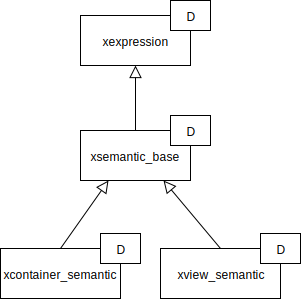
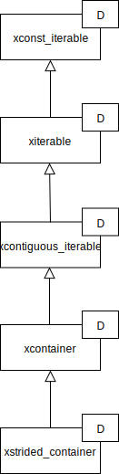

.. Copyright (c) 2016, Johan Mabille, Sylvain Corlay and Wolf Vollprecht

   Distributed under the terms of the BSD 3-Clause License.

   The full license is in the file LICENSE, distributed with this software.

.. _concepts-label:

Concepts
========

`xtensor`'s core is built upon key concepts captured in interfaces that are put together in derived
classes through CRTP (`Curiously Recurring Template Pattern
<https://en.wikipedia.org/wiki/Curiously_recurring_template_pattern>`_) and multiple inheritance.
Interfaces and classes that model expressions implement *value semantic*. CRTP and value semantic
achieve static polymorphism and avoid performance overhead of virtual methods and dynamic
dispatching.

xexpression
~~~~~~~~~~~

``xexpression`` is the base class for all expression classes. It is a CRTP base whose template
parameter must be the most derived class in the hierarchy. For instance, if ``A`` inherits
from ``B`` which in turn inherits from ``xexpression``, then ``B`` should be a template
class whose template parameter is ``A`` and should forward this parameter to ``xexpression``:

.. code::

    #include <xtensor/xexpression.hpp>

    template <class T>
    class B : public xexpression<T>
    {
        // ...
    };

    class A : public B<A>
    {
        // ...
    };

``xexpression`` only provides three overloads of a same function, that cast an ``xexpression``
object to the most inheriting type, depending on the nature of the object (*lvalue*,
*const lvalue* or *rvalue*):

.. code::

    derived_type& derived_cast() & noexcept;
    const derived_type& derived_cast() & noexcept;
    derived_type derived_cast() && noexcept;

.. _xiterable-concept-label:

xiterable
~~~~~~~~~

The iterable concept is modeled by two classes, ``xconst_iterable`` and ``xiterable``, defined
in ``xtensor/xiterable.hpp``. ``xconst_iterable`` provides types and methods for iterating on
constant expressions, similar to the ones provided by the STL containers. Unlike the STL, the
methods of ``xconst_iterable`` and ``xiterable`` are templated by a layout parameter that allows
you to iterate over a N-dimensional expression in row-major order or column-major order.

.. note::

    Row-major layout means that elements that only differ by their last index are contiguous in
    memory. Column-major layout means that elements that only differ by their first index are
    contiguous in memory.

    .. image:: iteration.svg

.. code::

    template <class L>
    const_iterator begin() const noexcept;
    template <class L>
    const_iterator end() const noexcept;
    template <class L>
    const_iterator cbegin() const noexcept;
    template <class L>
    const_iterator cend() const noexcept;

    template <class L>
    const_reverse_iterator rbegin() const noexcept;
    template <class L>
    const_reverse_iterator rend() const noexcept;
    template <class L>
    const_reverse_iterator crbegin() const noexcept;
    template <class L>
    const_reverse_iterator crend() const noexcept;

This template parameter is defaulted to ``XTENSOR_DEFAULT_TRAVERSAL`` (see :ref:`configuration-label`), so
that `xtensor` expressions can be used in generic code such as:

.. code::

    std::copy(a.cbegin(), a.cend(), b.begin());

where ``a`` and ``b`` can be arbitrary types (from `xtensor`, the STL or any external library)
supporting standard iteration.

``xiterable`` inherits from ``xconst_iterable`` and provides non-const counterpart of methods
defined in ``xconst_iterable``. Like ``xexpression``, both are CRTP classes whose template
parameter must be the most derived type.

Besides traditional methods for iterating, ``xconst_iterable`` and ``xiterable`` provide overloads
taking a shape parameter. This allows to iterate over an expression as if it was broadcast to the
given shape:

.. code::

    #include <algorithm>
    #include <iterator>
    #include <iostream>
    #include <xtensor/xarray.hpp>

    int main(int argc, char* argv[])
    {
        xt::xarray<int> a = { 1, 2, 3 };
        std::vector<std::size_t> shape = { 2, 3 };
        std::copy(a.cbegin(shape), a.cend(shape), std::output_iterator(std::cout, " "));
        // output: 1 2 3 1 2 3
    }

Iterators returned by methods defined in ``xconst_iterable`` and ``xiterable`` are random access
iterators.

.. _xsemantic-concept-label:

xsemantic
~~~~~~~~~

The ``xsemantic_base`` interface provides methods for assigning an expression:

.. code::

    template <class E>
    disable_xexpression<E, derived_type&> operator+=(const E&);

    template <class E>
    derived_type& operator+=(const xexpression<E>&);

and similar methods for ``operator-=``, ``operator*=``, ``operator/=``, ``operator%=``,
``operator&=``, ``operator|=`` and ``operator^=``.

The first overload is meant for computed assignment involving a scalar; it allows to write code like

.. code::

    #include <xtensor/xarray.hpp>
    #include <xtensor/xio.hpp>

    int main(int argc, char* argv)
    {
        xarray<int> a = { 1, 2, 3 };
        a += 4;
        std::cout << a << std::endl;
        // outputs { 5, 6, 7 }
    }

We rely on SFINAE to remove this overload from the overload resolution set when the parameter that we want
to assign is not a scalar, avoiding ambiguity.

Operator-based methods taking a general ``xexpression`` parameter don't perform a direct assignment. Instead,
the result is assigned to a temporary variable first, in order to prevent issues with aliasing. Thus, if ``a``
and ``b`` are expressions, the following

.. code::

    a += b

is equivalent to

.. code::

    temporary_type tmp = a + b;
    a.assign(tmp);

Temporaries can be avoided with the assign-based methods:

.. code::

    template <class E>
    derived_type& plus_assign(const xexpression<E>&);
    template <class E>
    derived_type&> minus_assign(const xexpression<E>&);
    template <class E>
    derived_type& multiplies_assign(const xexpression<E>&);
    template <class E>
    derived_type& divides_assign(const xexpression<E>&);
    template <class E>
    derived_type& modulus_assign(const xexpression<E>&);

``xsemantic_base`` is a CRTP class whose parameter must be the most derived type in the hierarchy. It inherits
from ``xexpression`` and forwards its template parameter to this latter one.

``xsemantic_base`` also provides a assignment operator that takes an ``xexpression`` in its protected section:

.. code::

    template <class E>
    derived_type& operator=(const xexpression<E>&);

Like computed assignment operators, it evaluates the expression inside a temporary before calling the ``assign``
method. Classes inheriting from ``xsemantic_base`` must redeclare this method either in their protected section
(if they are not final classes) or in their public section. In both cases, they should forward the call to their
base class.

Two refinements of this concept are provided, ``xcontainer_semantic`` and ``xview_semantic``. Refer to the
:ref:`xtensor-assign-label` section for more details about semantic classes and how they're involved in expression
assignment.

xsemantic classes hierarchy:

.. _xcontainer-concept-label:

xcontainer
~~~~~~~~~~

The ``xcontainer`` class provides methods for container-based expressions. It does not hold any data, this is delegated
to inheriting classes. It assumes the data are stored using a strided-index scheme. ``xcontainer`` defines the following
methods:

**Shape, strides and size**

.. code::

    size_type size() const noexcept;
    size_type dimension() const noexcept;

    const inner_shape_type& shape() const noexcept;
    const inner_strides_type& strides() const noexcept;
    const inner_backstrides_type& backstrides() const noexcept;

**Data access methods**

.. code::

    template <class... Args>
    const_reference operator()(Args... args) const;

    template <class... Args>
    const_reference at(Args... args) const;

    template <class S>
    disable_integral_t<S, const_reference> operator const;

    template <class I>
    const_reference operator const;

    template <class It>
    const_reference element(It first, It last) const;

    const storage_type& storage() const;

(and their non-const counterpart)

**Broadcasting methods**

.. code::

    template <class S>
    bool broadcast_shape(const S& shape) const;

Lower-level methods are also provided, meant for optimized assignment and BLAS bindings.
They are covered in the :ref:`xtensor-assign-label` section.

If you read the entire code of ``xcontainer``, you'll notice that two types are defined for shape,
strides and backstrides: ``shape_type`` and ``inner_shape_type``, ``strides_type`` and
``inner_strides_type``, and ``backstrides_type`` and ``inner_backstrides_type``. The distinction
between ``inner_shape_type`` and ``shape_type`` was motivated by the xtensor-python wrapper around
numpy data structures, where the inner shape type is a proxy on the shape section of the numpy
arrayobject. It cannot have a value semantics on its own as it is bound to the entire numpy array.

``xstrided_container`` inherits from ``xcontainer``; it represents a container that holds its shape
and strides. It provides methods for reshaping the container:

.. code::

    template <class S = shape_type>
    void resize(D&& shape, bool force = false);

    template <class S = shape_type>
    void resize(S&& shape, layout_type l);

    template <class S = shape_type>
    void resize(S&& shape, const strides_type& strides);

    template <class S = shape_type>
    void reshape(S&& shape, layout_type l);

Both ``xstrided_container`` and ``xcontainer`` are CRTP classes whose template parameter must be
the most derived type in the hierarchy. Besides, ``xcontainer`` inherits from ``xiterable``,
thus providing iteration methods.

xfunction
~~~~~~~~~

The ``xfunction`` class is used to model mathematical operations and functions. It provides similar
methods to the ones defined in ``xcontainer``, and embeds the functor describing the operation and
its operands. It inherits from ``xconst_iterable``, thus providing iteration methods.
