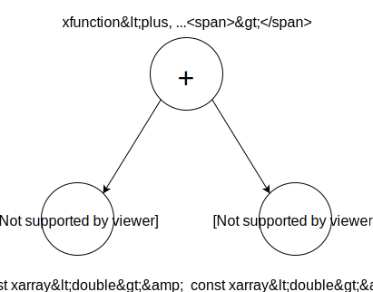

.. Copyright (c) 2016, Johan Mabille, Sylvain Corlay and Wolf Vollprecht

   Distributed under the terms of the BSD 3-Clause License.

   The full license is in the file LICENSE, distributed with this software.

Expression tree
===============

Most of the expressions in `xtensor` are lazy-evaluated, they do not hold any value, the values are computed upon
access or when the expression is assigned to a container. This means that `xtensor` needs somehow to keep track of
the expression tree.

xfunction_base / xfunction
~~~~~~~~~~~~~~~~~~~~~~~~~~

A node in the expression tree may be represented by different classes in `xtensor`; here we focus on basic arithmetic
operations and mathematical functions, which are represented by an instance of ``xfunction_base``. This is a template
class whose parameters are:

- a functor describing the operation of the mathematical function
- the return type, computing from the types of the child expressions involved in the operation
- the closures of the child expressions, i.e. the most optimal way to store each child expression

Although ``xfunction_base`` provides the API required for an ``expression``, it is not the final class representing
expression tree nodes, it is meant to be inherited. This allow to define function classes with a richer API and to
extend `xtensor`'s expression system. The implementation class used to represent operations and mathematical functions
in `xtensor` is ``xfunction``, it accepts the same template parameters as its base class. It contains nothing more
than constructors and assign operators, all the magic being done in ``xfunction_base``.

Consider the following code:

.. code::

    xarray<double> a = xt::ones({2, 2});
    xarray<double> b = xt::ones({2, 2});

    auto f = (a + b);

Here the type of ``f`` is ``xfunction<plus, double, const xarray<double>&, const xarray<double>&>``, and f stores constant
references on the arrays involved in the operation. This can be illustrated by the figure below:

The implementation of ``xfunction_base`` methods is quite easy: they forward the call to the nodes and apply the operation
when this makes sense. For instance, assuming that the operands are stored as ``m_first`` and ``m_second``, and the functor
describing the operation as ``m_functor``, the implementation of ``operator()`` and ``broadcast_shape`` looks like:

.. code::

    template <class F, class R, class... CT>
    template <class... Args>
    inline auto xfunction_base<F, R, CT...>::operator()(Args... args) const -> const_reference
    {
        return m_functor(m_first(args...), m_second(args...));
    }

    template <class F, class R, class... CT>
    template <class S>
    inline bool xfunction_base<F, R, CT...>::broadcast_shape(S& shape) const
    {
        return m_first.broadcast_shape(shape) && m_second.broadcast_shape(shape);
    }

In fact, ``xfunction_base`` can handle an arbitrary number of arguments. The practical implementation is slightly more
complicated than the code snippet above, however the principle remains the same.

Holding expressions
~~~~~~~~~~~~~~~~~~~

Each node of an expression tree holds const references to its child nodes, or the child nodes themselves, depending on
their nature. When building a complex expression, if a part of this expression is an rvalue, it is moved inside its
parent, else a constant reference is used:

.. code::

    xarray<double> some_function();

    xarray<double> a = xt::ones({2, 2});
    auto f = a + some_function();

Here ``f`` holds a constant reference on ``a``, while the array returned by ``some_function`` is moved into ``f``.
The actual types held by the expression are the **closure types**, more details can be found in :ref:`closure-semantics-label`.

Building the expression tree
~~~~~~~~~~~~~~~~~~~~~~~~~~~~

As previously stated, each mathematical function in xtensor returns an instance of ``xfunction``. This section explains
in details how the template parameters of ``xfunction`` are computed according to the type of the function, the number
and the types of its arguments. Let's consider the definition of ``operator+``:

.. code::

    template <class E1, class E2>
    inline auto operator+(E1&& e1, E2&& e2) -> detail::xfunction_type<detail::plus, E1, E2>
    {
        return detail::make_xfunction<detail::plus>(std::forward<E1>(e1), std::forward<E2>(e2));
    }

This top-level function selects the appropriate functor and forwards its arguments to the ``make_xfunction`` generator.
This latter is responsible for setting the remaining template parameters of ``xfunction``:

.. code::

    template <template <class...> class F, class... E>
    inline auto make_xfunction(E&&... e) noexcept
    {
        using expression_tag = xexpression_tag_t<E...>;
        using functor_type = build_functor_type_t<expression_tag, F, E...>;
        using type = select_xfunction_expression_t<expression_tag, functor_type, const_xclosure_t<E>...>;
        return type(functor_type(), std::forward<E>(e)...);
    }

The first line computes the ``expression_tag`` of the expression. This tag is used for selecting the right implementation
class inheriting from ``xfunction_base``. In `xtensor`, three tags are provided, with the following mapping:

- ``xscalar_expression_tag`` -> ``xfunction``
- ``xtensor_expression_tag`` -> ``xfunction``
- ``xoptional_expression_tag`` -> ``xoptional_function``

Any expression may define a tag as its ``expression_tag`` inner type. If not, ``xtensor_expression_tag`` is used by default.
Tags have different priorities so that a resulting tag can be computed for expressions involving different tag types. As we
will see in the next section, this system of tags and mapping make it easy to plug new functions types in `xtensor` and have
them working with all the mathematical functions already implemented.

The function class mapped to the expression tag is retrieved in the third line of ``make_xfunction``, that is:

.. code::

    using type = select_xfunction_expression_t<expression_tag, functor_type, const_xclosure_t<E>...>;

``const_closure_t`` computes the closure type (see :ref:`closure-semantics-label`) of each argument and passes it to the function
class to instantiate.

The exact type of the functor is computed thanks to the ``build_functor_type_t`` generator. It computes the return type of the
function according to the ``value_type`` of the arguments (most of the times, a simple type promotion is enough).

Once all the types are known, ``make_xfunction`` can instantiate the right function type and returns it:

.. code::

    return type(functor_type(), std::forward<E>(e)...);

Plugging new function types
~~~~~~~~~~~~~~~~~~~~~~~~~~~

As mentioned in the section above, one can define a new function class and have it used by `xtensor`'s expression system. Let's
illustrate this with the ``xoptional_function`` class. The first thing to do is to define a new tag:

.. code::

    struct xoptional_expression_tag
    {
    };

Then the tag selection rules must be updated if we want to be able to mix ``xtensor_expression_tag`` and ``xoptional_expression_tag``.
This is done by specializing the ``expression_tag_and`` metafunction available in the namespace ``xt::detail``:

.. code::

    namespace xt
    {
        namespace detail
        {
            template <>
            struct expression_tag_and<xtensor_expression_tag, xoptional_expression_tag>
            {
                using type = xoptional_expression_tag;
            };

            template <>
            struct expression_tag_and<xoptional_expression_tag, xtensor_expression_tag>
                : expression_tag_and<xtensor_expression_tag, xoptional_expression_tag>
            {
            };
        }
    }

The second specialization simply forwards to the first one so we don't duplicate code. Note that when plugging your own
function class, these specializations can be skipped if the new function class (and its corresponding tag) is not compatible,
and thus not supposed to be mixed, with the function classes provided by `xtensor`.

The las thing required is to specialize the ``select_xfunction_expression`` metafunction, as it is shown below:

.. code::

    namespace xt
    {
        namespace detail
        {
            template <class F, class... E>
            struct select_xfunction_expression<xoptional_expression_tag, F, E...>
            {
                using type = xoptional_function<F, typename F::result_type, E...>;
            };
        }
    }

In this example, ``xoptional_function`` inherits from ``xfunction_base`` and define some additional methods, so it provides a
richer API the ``xfunction``. However it is possible to define a function class with a different API, thus not inheriting from
``xfunction_base``. In that case, the assignment mechanics need to be customized too, this is detailed in :ref:`xtensor-assign-label`.

