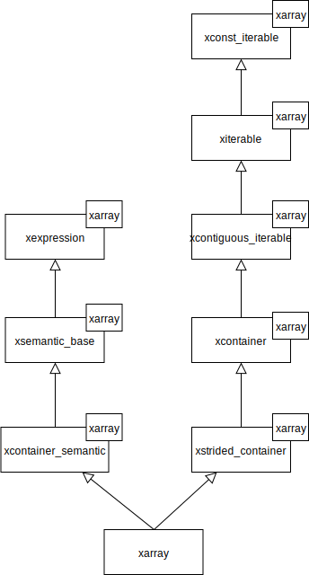

.. Copyright (c) 2016, Johan Mabille, Sylvain Corlay and Wolf Vollprecht

   Distributed under the terms of the BSD 3-Clause License.

   The full license is in the file LICENSE, distributed with this software.

Implementation classes
======================

Requirements
~~~~~~~~~~~~

An implementation class in `xtensor` is a final class that models a specific
kind of expression. It must inherit (either directly or indirectly) from
``xexpression`` and define (or inherit from classes that define) the following
types:

**container types**

.. code::

    value_type;
    reference;
    const_reference;
    pointer;
    const_pointer;
    size_type;
    difference_type;
    shape_type;

**iterator types**

.. code::

    iterator;
    const_iterator;
    reverse_iterator;
    const_reverse_iterator;

    template <class S, layout_type L>
    broadcast_iterator<S, L>;
    template <class S, layout_type L>
    const_broadcast_iterator<S, L>;
    template <class S, layout_type L>
    reverse_broadcast_iterator<S, L>;
    template <class S, layout_type L>
    const_reverse_broadcast_iterator<S, L>;

    storage_iterator;
    const_storage_iterator;
    reverse_storage_iterator;
    const_reverse_storage_iterator;

**layout data**

.. code::

    static layout_type static_layout;
    static bool contiguous_layout;

It must also provide the following methods, either by defining them
itself, or by inheriting from classes that define them, partially or
totally:

**shape methods**

.. code::

    size_type size() const noexcept;
    size_type dimension() const noexcept;
    const inner_shape_type& shape() const noexcept;

**broadcasting methods**

.. code::

    template <class S>
    bool broadcast_shape(const S& shape) const;

    template <class S>
    bool is_trivial_broadcast(const S& strides) const;

**data access methods**

.. code::

    template <class... Args>
    const_reference operator()(Args... args) const;

    template <class... Args>
    const_reference at(Args... args) const;

    template <class... Args>
    const_reference unchecked(Args... args) const;

    template <class S>
    disable_integral_t<S, const_reference> operator const;

    template <class I>
    const_reference operator const;

    template <class It>
    const_reference element(It first, It last) const;

    const storage_type& storage() const;

**iteration methods**

These methods are usually provided by inheriting from ``xconst_iterable`` or ``xiterable``.
See :ref:`iterating-expression-label` for more details.

If the expression is mutable, it must also define the non-const counterparts of the data access
methods, and inherits from a semantic class to provide assignment operators.

List of available expression classes
~~~~~~~~~~~~~~~~~~~~~~~~~~~~~~~~~~~~

`xtensor` provides the following expression classes:

**Containers**

- ``xarray_container`` : N-dimensional array with dynamic shape
- ``xarray_adaptor``   : N-dimensional array adaptor for STL-like containers or C arrays
- ``xtensor_container``: N-dimensional array with static number of dimensions
- ``xtensor_adaptor``  : N-dimensional tensor adaptor for STL-like containers or C arrays
- ``xfixed_container`` : N-dimensional array with static shape
- ``xfixed_adaptor``   : N-dimensoinal fixed tensor adaptor for STL-like containers or C arrays

Most of the methods of these classes are implemented in the base class ``xcontainer``, the
inheriting classes only provide constructors and assignment operators for the value semantic.

The container classes are generally used through type aliases which set many of the template
arguments:

- ``xarray``
- ``xtensor``
- ``xfixed_tensor``

The classes for adaptors can be instantiated through the many overloads of ``xt::adapt`` function,
so that their templates parameters are deduced.

**Scalar**

`xtensor` provides the ``xscalar`` class to adapt scalar values and give them the required API.

**Optional containers**

- ``xoptional_assembly``        : N-dimensional array holding optional values.
- ``xoptional_assembly_adaptor``: N-dimensional adaptor holding optional values.

Most of the mehtods of these classes are defined in their base class ``xoptional_assembly_base``.

**Views**

- ``xview``: N-dimensional view with static number of slices, supporting all kind of slices
- ``xstrided_view``: N-dimensional view with dynamic number of slices, supporting strided slices only (see below)
- ``xdynamic_view``: N-dimensional view with dynamic number of slices, supporting all kind of slices
- ``xfunctor_view``: N-dimensional view applying a functor to its underlying elements (e.g. ``imag``, ``real``)
- ``xindex_view``  : Flat (1D) view yielding the values at the indices of its index array
- ``xmasked_view`` : View on optional expression hiding values depending on a mask

When the index of an element in the underlying expression of a view can be computed thanks to a strided scheme,
the slice used in this view is said to be a strided slice. `xtensor` provides the following strided slices:

- ``xrange``
- ``xstepped_range``
- ``xall``
- ``xnewaxis``

The following slices are not strided, and thus incompatible with ``xstrided_view``:

- ``xkeep_slice``
- ``xdrop_slice``

**Functional expressions**

Contrary to containers and views, the functional expressions are immutable.

- ``xbroadcast``: Broadcasts an expression to a specific shape
- ``xfunction`` : N-dimensional function operating on tensor expressions
- ``xgenerator``: N-dimensional function operating on indices
- ``xreducer``  : Reducing function operating over specified axes

xarray and xtensor
~~~~~~~~~~~~~~~~~~

Although they represent different concepts, ``xarray`` and ``xtensor`` have really similar
implementations so only ``xarray`` will be covered.

``xarray`` is a strided array expression that can be assigned to. Everything ``xarray`` needs
is already defined in classes modeling :ref:`concepts-label`, so ``xarray`` only has to inherit
from these classes and define constructors and assignment operators:

Besides implementing the methods that define value semantic, ``xarray`` and ``xtensor`` hold
the data container. Since the ``xcontainer`` base class implements all the logic for accessing
the data, it must me able to access the data container. This is achieved by requiring that
every class inheriting from ``xcontainer`` provides the following methods:

.. code::

    storage_type& storage_impl() noexcept;
    const storage_type& storage_impl() const noexcept;

These are the implementation methods of the ``storage()`` interface methods defined in ``xcontainer``,
and thus are defined in the private section of ``xarray`` and ``xtensor``. In order to grant access
to ``xcontainer``, this last one is declared as ``friend``:

.. code::

    template <class EC, layout_type L, class SC, class Tag>
    class xarray : public xstrided_container<xarray<EC, L, SC, Tag>,
                   public xcontainer_semantic<xarray<EC, L, SC, Tag>>
    {
    public:

        // ....

    private:

        storage_type m_storage;
        storage_type& storage() noexcept;
        const storage_type& storage() const noexcept;

        friend class xcontainer<xarray<EC, L, SC, Tag>>;
    };

This pattern is similar to the template method pattern used in hierarchy of classes with
entity semantic (see virtuality_).

Inner types definition
~~~~~~~~~~~~~~~~~~~~~~

Although the base classes use the types defined in the Requirement section, they cannot
define them; first because different base classes may need the same types and we want
to avoid duplication of type definitions. The second reason is that most of the types
may rely on other types specific to the implementation classes. For instance,
``value_type``, ``reference``, etc,  of ``xarray`` are simply the types defined in the
container type hold by ``xarray``:

.. code::

    using value_type = typename storage_type::value_type;
    using reference = typename storage_type::reference;
    using const_reference = typename storage_type::const_reference;
    ...

Moreover, CRTP base classes cannot access inner types defined in CRTP leaf classes, because
a CRTP leaf class is only declared, not defined, when the CRTP base class is being defined.

The solution is to define those types in an external structure that is specialized for
each CRTP leaf class:

.. code::

    // Declaration only, no generic definition
    template <class C>
    struct xcontainer_inner_types;

In ``xarray.hpp``

.. code::

    template <class EC, layout_type L, class SC, class Tag>
    struct xcontainer_inner_types<xarray<EC, L,SC, Tag>>
    {
        // Definition of types required by CRTP bases
    };

In order to avoid a lot of boilerplate, the CRTP base classes expect only a few types to be defined
in this structure, and then compute the other types, based on these former definitions. The requirements
on types definition regarding the base classes is detailed below.

**xsemantic**

The semantic classes only expect the following type: ``temporary_type``.

**xcontainer**

``xcontainer`` and ``xstrided_container`` expect the following types to be defined:

.. code::

    storage_type;
    shape_type;
    strides_type;
    backstrides_type;
    inner_shape_type;
    inner_strides_type;
    inner_backstrides_type;
    layout_type;

.. _xiterable-inner-label:

**xiterable**

Since many expressions are not containers, the definition of types required by the iterable concept is
done in a dedicated structure following the same pattern as ``xcontainer_inner_types``, i.e. a sturcture
declared and specialized for each final class:

.. code::

    template <class C>
    struct xiterable_inner_types;

The following types must be defined in each specialization:

.. code::

    inner_shape_type;
    const_stepper;
    stepper;

More detail about the stepper types is given in :ref:`iterating-expression-label`.

.. _virtuality: http://www.gotw.ca/publications/mill18.htm
