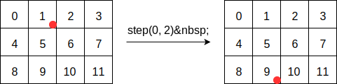
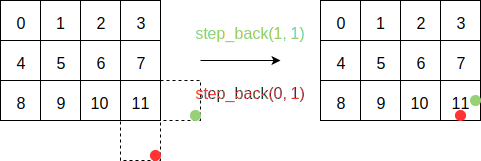
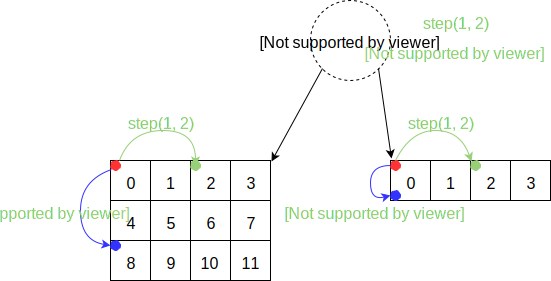
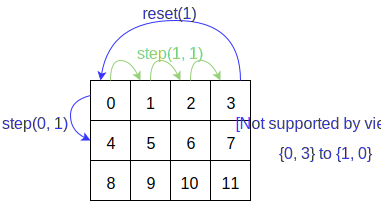

.. Copyright (c) 2016, Johan Mabille, Sylvain Corlay and Wolf Vollprecht

   Distributed under the terms of the BSD 3-Clause License.

   The full license is in the file LICENSE, distributed with this software.

.. _iterating-expression-label:

Iterating over expressions
==========================

xiterable and inner types
~~~~~~~~~~~~~~~~~~~~~~~~~

`xtensor` provides two base classes for making expressions iterable: ``xconst_iterable`` and ``xiterable``. They define
the API for iterating as described in :ref:`concepts-label`. For an expression to be iterable, it must inherit directly
or indirectly from one of these classes. For instance, the ``xbroadcast`` class is defined as following:

.. code::

    template <class CT, class X>
    class xbroadcast : public xexpression<xbroadcast<CT, X>>,
                       public xconst_iterable<xbroadcast<CT, X>>
    {
        // ...
    };

Some of the methods provided by ``xconst_iterable`` or ``xiterable`` may need to be refined in the inheriting class.
In that case, a common pattern is to make the inheritance private, import the methods we need with using declaration
and redefine the methods whose behavior differ from the one provided in the base class. This is what is done in
``xfunction_base``:

.. code::

    template <class F, class R, class... CT>
    class xfunction_base : private xconst_iterable<xfunction_base<F, R, CT...>>
    {
    public:

        using self_type = xfunction_base<F, R, CT...>;
        using iterable_base = xconst_iterable<self_type>;

        using iterable_base::begin;
        using iterable_base::end;
        using iterable_base::cbegin;
        using iterable_base::cend;
        using iterable_base::rbegin;
        using iterable_base::rend;
        using iterable_base::crbegin;
        using iterable_base::crend;

        template <layout_type L = DL>
        const_storage_iterator storage_begin() const noexcept;
        template <layout_type L = DL>
        const_storage_iterator storage_end() const noexcept;
        template <layout_type L = DL>
        const_storage_iterator storage_cbegin() const noexcept;
        template <layout_type L = DL>
        const_storage_iterator storage_cend() const noexcept;

        template <layout_type L = DL>
        const_reverse_storage_iterator storage_rbegin() const noexcept;
        template <layout_type L = DL>
        const_reverse_storage_iterator storage_rend() const noexcept;
        template <layout_type L = DL>
        const_reverse_storage_iterator storage_crbegin() const noexcept;
        template <layout_type L = DL>
        const_reverse_storage_iterator storage_crend() const noexcept;
    };

The implementation of the iterator methods defined in ``xconst_iterable`` and ``xiterable`` rely on a few
types and methods that must be defined in the inheriting class.

First, as stated in the :ref:`xiterable section <xiterable-inner-label>`, the ``xiterable_inner_types`` structure must be
specialized as illustrated below:

.. code::

    template <class F, class R, class... CT>
    struct xiterable_inner_types<xfunction_base<F, R, CT...>>
    {
        using inner_shape_type = promote_shape_t<typename std::decay_t<CT>::shape_type...>;
        using const_stepper = xfunction_stepper<F, R, CT...>;
        using stepper = const_stepper;
    };

Then the inheriting class must define the following methods:

.. code::

    template <class S>
    const_stepper stepper_begin(const S& shape) const noexcept;
    template <class S>
    const_stepper stepper_end(const S& shape, layout_type l) const noexcept;

If the expression class inherits from ``xiterable`` instead of ``xconst_iterable``, the non-const counterparts
of the previous methods must also be defined. Every method implemented in one of the base class eventually calls
one of these stepper methods, whose mechanics is explained hereafter.

.. _stepper-label:

Steppers
~~~~~~~~

Steppers are the low-level tools for iterating over expressions. They provide a raw API for "stepping" of a given
amount in a given dimension, dereferencing the stepper, and moving it to the beginning or the end of the expression:

.. code::

    reference operator*() const;
    
    void step(size_type dim, size_type n = 1);
    void step_back(size_type dim, size_type n = 1);
    void reset(size_type dim);
    void reset_back(size_type dim);

    void to_begin();
    void to_end(layout_type l);

The ``reset`` and ``reset_back`` methods are shortcut to ``step_back`` and ``step`` called with ``dim`` and ``shape[dim] - 1``.
The steppers are initialized with a "position" (that may be an index, a pointer to the underlying buffer of an container-based
expression, etc...) in the expression, and can then be used to browse the expression in any direction:

In this diagram, the data is stored in row-major order, and we step in the first dimension (dimension index starts at 0).
The positions of the stepper are represented by the red dots.

The ``to_end`` method takes a layout parameter, because the ending positions of a stepper depend on the layout used to iterate.
Indeed, if we call ``step_back`` after a call to ``to_end``, we want the stepper to point to the last element. To ensure this
for both row-major order and column-major order iterations, the ending positions must be set as shown below:

The red dots are the position of a stepper iterating in column-major while the green ones are the positions of a stepper iterating
in row-major order. Thus, if we assume that ``p`` is a pointer to the last element (the square containing 11), the ending positions
of the stepper are ``p + 1`` in row-major, and ``p + 3`` in column-major order.

A stepper is specific to an expression type, therefore implementing a new kind of expression usually requires to implement a new
kind of stepper. However `xtensor` provides a generic ``xindexed_stepper`` class, that can be used with any kind of expressions.
Even though it is generally not optimal, authors of new expression types can make use of the generic index stepper in a
first implementation.

Broadcasting
~~~~~~~~~~~~

The steppers of container-based expressions rely on strides and backstrides for stepping. A naive implementation of the ``step``
method would be:

.. code::

    template <class C>
    inline void xstepper<C>::step(size_type dim, size_type n)
    {
        m_it += n * p_c->strides()[dim];
    }

where ``m_it`` is an iterator on the underlying buffer, and ``p_c`` a pointer to the container-based expression.

However, this implementation fails when broadcasting is involved. Consider the following expression:

.. code::

    xarray<int> a = {{0, 1,  2,  3},
                     {4, 5,  6,  7},
                     {8, 9, 10, 11}};
    xarray<int> b = {0, 1, 2, 3};
    auto r = a + b;

``r`` is an ``xfunction`` representing the sum of ``a`` and ``b``. The stepper specific to this expression holds the steppers
of the arguments of the function; calling ``step`` or ``step_back`` results in calling ``step`` or ``step_back`` of the
steppers of ``a`` and ``b``.

According to the broadcasting rules, the shape of ``r`` is ``{ 3, 4}``. Thus, calling ``r.stepper_begin().step(1, 1)`` will
eventually call ``b.stepper_begin().step(1, 1)``, leading to undefined behavior since the shape of ``b`` is ``{4}``. To
avoid that, a broadcasting offset is added to the stepper:

.. code::

    template <class C>
    inline void xstepper<C>::step(size_type dim, size_type n)
    {
        if (dim >= m_offset)
        {
            m_it += difference_type(n * p_c->strides()[dim - m_offset]);
        }
    }

This implementation takes into account that the broadcasting is done on the last dimension and dimensions are stored in ascending
order; here dimension 1 of ``a`` corresponds to dimension 0 of ``b``.

This implementation ensures that a step in dimension 0 of the function updates the stepper of ``a`` while the stepper of ``b``
remains unchanged; on the other hand, stepping in dimension 1 will update both steppers, as illustrated below:

The red dots are initial stepper positions, the green dots and blue dots are the positions of the steppers after calling ``step``
with different dimension arguments.

Iterators
~~~~~~~~~

`xtensor` iterator is implemented in the ``xiterator`` class. This latter provides a STL compliant iterator interface, and is built
upon the steppers. Whereas the steppers are tied to the expression they refer to, ``xiterator`` is generic enough to work with any
kind of stepper.

An iterator holds a stepper and a multi-dimensional index. A call to ``operator++`` increases the index and calls the ``step`` method
of the stepper accordingly. The way the index is increased depends on the layout used for iterating. For a row-major order iteration
over a container with shape ``{3, 4}``, the index iterating sequence is:

.. code::

    {0, 0}
    {0, 1}
    {0, 2}
    {0, 3}
    {1, 0}
    {1, 1}
    {1, 2}
    {1, 3}
    {2, 0}
    {2, 1}
    {2, 2}
    {2, 3}

When a member of an index reaches its maximum value, it is reset to 0 and the member in the next dimension is increased. This translates
into the calls of two methods of the stepper, first ``reset`` and then ``step``. This is illustrated by the following picture:

The green arrows represent the iteration from ``{0, 0}`` to ``{0, 3}``. The blue arrows illustrate what happens when the index is increased
from ``{0, 3}`` to ``{1, 0}``: first the stepper is reset to ``{0, 0}``, then ``step(0, 1)`` is called, setting the stepper to the position
``{1, 0}``.

``xiterator`` implements a random access iterator, providing ``operator--`` and ``operator[]`` methods. The implementation of these methods
is similar to the one of ``operator++``.

