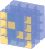

.. Copyright (c) 2016, Johan Mabille, Sylvain Corlay and Wolf Vollprecht

   Distributed under the terms of the BSD 3-Clause License.

   The full license is in the file LICENSE, distributed with this software.

Notable differences with numpy
==============================

xtensor and numpy are very different libraries in their internal semantics. While xtensor
is a lazy expression system, numpy manipulates in-memory containers, however, similarities in
APIs are obvious. See e.g. the numpy to xtensor cheat sheet.

And this page tracks the subtle differences of behavior between numpy and xtensor.

Zero-dimensional arrays
-----------------------

With numpy, 0-D arrays are nearly indistinguishable from scalars. This led to some issues w.r.t.
universal functions returning scalars with 0-D array inputs instead of actual arrays...

In xtensor, 0-D expressions are not implicitly convertible to scalar values. Values held by 0-D
expressions can be accessed in the same way as values of higher dimensional arrays, that is with
``operator[]``, ``operator()`` and ``element``.

Accumulators (``cumsum``, ``cumprod``) throw an exception if an axis argument is passed and the
array argument is a 0-D argument:

.. code::

    #include <xtensor/xarray.hpp>
    #include <xtensor/xio.hpp>

    xt::xarray<double> x = 1;
    std::cout << xt::cumsum(x, 0) << std::endl;
    // Outputs:
    // Standard Exception: Axis larger than expression dimension in accumulator.

    std::cout << xt::cumsum(x) << std::endl;
    //Outputs:
    // 1

Meshgrid
--------

:any:`numpy.meshgrid` supports two modes: the 'xy' indexing and the 'ij' indexing.

The following code

.. code-block:: python

    import numpy as np

    x1, x2, x3, x4 = [1], [10, 20], [100, 200, 300], [1000, 2000, 3000, 4000]

    ij = np.meshgrid(x1, x2, x3, x4, indexing='ij')
    xy = np.meshgrid(x1, x2, x3, x4, indexing='xy')

    print 'ij:', [m.shape for m in ij]
    print 'xy:', [m.shape for m in xy]

would return

.. code-block:: python

    ij: [(1, 2, 3, 4), (1, 2, 3, 4), (1, 2, 3, 4), (1, 2, 3, 4)]
    xy: [(2, 1, 3, 4), (2, 1, 3, 4), (2, 1, 3, 4), (2, 1, 3, 4)]

In other words, the 'xy' indexing, which is the default only reverses the first two dimensions
compared to the 'ij' indexing.

xtensor's version of meshgrid corresponds to the 'ij' indexing.

The random module
-----------------

Like most functions of xtensor, functions of the random module return expressions that don't hold any value.

Every time an element is accessed, a new random value is generated. To fix the values of a generator, it should
be assigned to a container such as xarray or xtensor.

Missing values
--------------

Support of missing values in numpy can be emulated with the masked array module,
which provides a means to handle arrays that have missing or invalid data.

Support of missing values in xtensor is done through a notion of optional values, implemented in ``xoptional<T, B>``, which serves both as a value type for container and as a reference proxy for optimized storage types. See the section of the documentation on :doc:`missing`.

Strides
-------

Strided containers of xtensor and numpy having the same exact memory layout may have different strides when accessing them through the ``strides`` attribute.
The reason is an optimization in xtensor, which is to set the strides to ``0`` in dimensions of length ``1``, which simplifies the implementation of broadcasting of universal functions.

Array indices
-------------

Array indices are in xtensor stored as a ``std::vector`` of array indices, whereby each entry corresponds to the array indices of one item. This results in a slightly different usage of ``xt::ravel_indices`` than of :any:`numpy.ravel_multi_index`.
