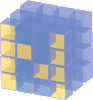

.. Copyright (c) 2016, Johan Mabille, Sylvain Corlay and Wolf Vollprecht

   Distributed under the terms of the BSD 3-Clause License.

   The full license is in the file LICENSE, distributed with this software.

From numpy to xtensor
=====================

.. raw:: html

   

Containers
----------

Two container types are provided. ``xarray`` (dynamic number of dimensions) and ``xtensor``
(static number of dimensions).

+------------------------------------------------+------------------------------------------------+
|             Python 3 - numpy                   |               C++ 14 - xtensor                 |
+================================================+================================================+
| ``np.array([[3, 4], [5, 6]])``                 | | ``xt::xarray<double>({{3, 4}, {5, 6}})``     |
|                                                | | ``xt::xtensor<double, 2>({{3, 4}, {5, 6}})`` |
+------------------------------------------------+------------------------------------------------+
| ``arr.reshape([3, 4])``                        | ``arr.reshape({3, 4})``                        |
+------------------------------------------------+------------------------------------------------+
| ``arr.astype(np.float64)``                     | ``xt::cast<double>(arr)``                      |
+------------------------------------------------+------------------------------------------------+

Initializers
------------

Lazy helper functions return tensor expressions. Return types don't hold any value and are
evaluated upon access or assignment. They can be assigned to a container or directly used in
expressions.

+-----------------------------------------------+-----------------------------------------------+
|             Python 3 - numpy                  |               C++ 14 - xtensor                |
+===============================================+===============================================+
| ``np.linspace(1.0, 10.0, 100)``               | ``xt::linspace<double>(1.0, 10.0, 100)``      |
+-----------------------------------------------+-----------------------------------------------+
| ``np.logspace(2.0, 3.0, 4)``                  | ``xt::logspace<double>(2.0, 3.0, 4)``         |
+-----------------------------------------------+-----------------------------------------------+
| ``np.arange(3, 7)``                           | ``xt::arange(3, 7)``                          |
+-----------------------------------------------+-----------------------------------------------+
| ``np.eye(4)``                                 | ``xt::eye(4)``                                |
+-----------------------------------------------+-----------------------------------------------+
| ``np.zeros([3, 4])``                          | ``xt::zeros<double>({3, 4})``                 |
+-----------------------------------------------+-----------------------------------------------+
| ``np.ones([3, 4])``                           | ``xt::ones<double>({3, 4})``                  |
+-----------------------------------------------+-----------------------------------------------+
| ``np.empty([3, 4])``                          | ``xt::empty<double>({3, 4})``                 |
+-----------------------------------------------+-----------------------------------------------+
| ``np.meshgrid(x0, x1, x2, indexing='ij')``    | ``xt::meshgrid(x0, x1, x2)``                  |
+-----------------------------------------------+-----------------------------------------------+

xtensor's ``meshgrid`` implementation corresponds to numpy's ``'ij'`` indexing order.

Slicing and indexing
--------------------

+-----------------------------------------------------+-----------------------------------------------------+
|             Python 3 - numpy                        |                   C++ 14 - xtensor                  |
+=====================================================+=====================================================+
| ``a[3, 2]``                                         | ``a(3, 2)``                                         |
+-----------------------------------------------------+-----------------------------------------------------+
| ``a[:5, 1:]``                                       | ``xt::view(a, xt::range(_, 5), xt::range(1, _))``   |
+-----------------------------------------------------+-----------------------------------------------------+
| ``a[5:1:-1, :]``                                    | ``xt::view(a, xt::range(5, 1, -1), xt::all())``     |
+-----------------------------------------------------+-----------------------------------------------------+
| ``a[..., 3]``                                       | ``xt::strided_view(a, {xt::ellipsis, 3})``          |
+-----------------------------------------------------+-----------------------------------------------------+
| ``a[:, np.newaxis]``                                | ``xt::view(a, xt::all(), xt::newaxis())``           |
+-----------------------------------------------------+-----------------------------------------------------+

Broadcasting
------------

xtensor offers lazy numpy-style broadcasting, and universal functions. Unlike numpy, no copy
or temporary variables are created.

+-----------------------------------------------------+-----------------------------------------------------+
|             Python 3 - numpy                        |                   C++ 14 - xtensor                  |
+=====================================================+=====================================================+
| ``np.broadcast(a, [4, 5, 7])``                      | ``xt::broadcast(a, {4, 5, 7})``                     |
+-----------------------------------------------------+-----------------------------------------------------+
| ``np.vectorize(f)``                                 | ``xt::vectorize(f)``                                |
+-----------------------------------------------------+-----------------------------------------------------+
| ``a[a > 5]``                                        | ``xt::filter(a, a > 5)``                            |
+-----------------------------------------------------+-----------------------------------------------------+
| ``a[[0, 1], [0, 0]]``                               | ``xt::index_view(a, {{0, 0}, {1, 0}})``             |
+-----------------------------------------------------+-----------------------------------------------------+

Random
------

The random module provides simple ways to create random tensor expressions, lazily.

+-----------------------------------------------+-----------------------------------------------+
|            Python 3 - numpy                   |                C++ 14 - xtensor               |
+===============================================+===============================================+
| ``np.random.seed(0)``                         | ``xt::random::seed(0)``                       |
+-----------------------------------------------+-----------------------------------------------+
| ``np.random.randn(10, 10)``                   | ``xt::random::randn<double>({10, 10})``       |
+-----------------------------------------------+-----------------------------------------------+
| ``np.random.randint(10, 10)``                 | ``xt::random::randint<int>({10, 10})``        |
+-----------------------------------------------+-----------------------------------------------+
| ``np.random.rand(3, 4)``                      | ``xt::random::rand<double>({3, 4})``          |
+-----------------------------------------------+-----------------------------------------------+
| ``np.random.choice(arr, 5)``                  | ``xt::random::choice(arr, 5)``                |
+-----------------------------------------------+-----------------------------------------------+
| ``np.random.shuffle(arr)``                    | ``xt::random::shuffle(arr)``                  |
+-----------------------------------------------+-----------------------------------------------+
| ``np.random.permutation(30)``                 | ``xt::random::permutation(30)``               |
+-----------------------------------------------+-----------------------------------------------+

Concatenation, splitting, squeezing
-----------------------------------

Concatenating expressions does not allocate memory, it returns a tensor or view expression holding
closures on the specified arguments.

+--------------------------------------------------------------+------------------------------------------------------------+
|            Python 3 - numpy                                  |                C++ 14 - xtensor                            |
+==============================================================+============================================================+
| ``np.stack([a, b, c], axis=1)``                              | ``xt::stack(xtuple(a, b, c), 1)``                          |
+--------------------------------------------------------------+------------------------------------------------------------+
| ``np.hstack([a, b, c])``                                     | ``xt::hstack(xtuple(a, b, c))``                            |
+--------------------------------------------------------------+------------------------------------------------------------+
| ``np.vstack([a, b, c])``                                     | ``xt::vstack(xtuple(a, b, c))``                            |
+--------------------------------------------------------------+------------------------------------------------------------+
| ``np.concatenate([a, b, c], axis=1)``                        | ``xt::concatenate(xtuple(a, b, c), 1)``                    |
+--------------------------------------------------------------+------------------------------------------------------------+
| ``np.tile(a, reps)``                                         | ``xt::tile(a, reps)``                                      |
+--------------------------------------------------------------+------------------------------------------------------------+
| ``np.squeeze(a)``                                            | ``xt::squeeze(a)``                                         |
+--------------------------------------------------------------+------------------------------------------------------------+
| ``np.expand_dims(a, 1)``                                     | ``xt::expand_dims(a ,1)``                                  |
+--------------------------------------------------------------+------------------------------------------------------------+
| ``np.atleast_3d(a)``                                         | ``xt::atleast_3d(a)``                                      |
+--------------------------------------------------------------+------------------------------------------------------------+
| ``np.split(a, 4, axis=0)``                                   | ``xt::split(a, 4, 0)``                                     |
+--------------------------------------------------------------+------------------------------------------------------------+
| ``np.hsplit(a, 4)``                                          | ``xt::hsplit(a, 4)``                                       |
+--------------------------------------------------------------+------------------------------------------------------------+
| ``np.vsplit(a, 4)``                                          | ``xt::vsplit(a, 4)``                                       |
+--------------------------------------------------------------+------------------------------------------------------------+
| ``np.trim_zeros(a, trim='fb')``                              | ``xt::trim_zeros(a, "fb")``                                |
+--------------------------------------------------------------+------------------------------------------------------------+
| ``np.pad(a, pad_width, mode='constant', constant_values=0)`` | ``xt::pad(a, pad_width[, xt::pad_mode::constant][, 0])``   |
+--------------------------------------------------------------+------------------------------------------------------------+

Rearrange elements
------------------

In the same spirit as concatenation, the following operations do not allocate any memory and do
not modify the underlying xexpression.

+-----------------------------------------------+-----------------------------------------------+
|            Python 3 - numpy                   |                C++ 14 - xtensor               |
+===============================================+===============================================+
| ``np.diag(a)``                                | ``xt::diag(a)``                               |
+-----------------------------------------------+-----------------------------------------------+
| ``np.diagonal(a)``                            | ``xt::diagonal(a)``                           |
+-----------------------------------------------+-----------------------------------------------+
| ``np.triu(a)``                                | ``xt::triu(a)``                               |
+-----------------------------------------------+-----------------------------------------------+
| ``np.tril(a, k=1)``                           | ``xt::tril(a, 1)``                            |
+-----------------------------------------------+-----------------------------------------------+
| ``np.flip(a, axis=3)``                        | ``xt::flip(a, 3)``                            |
+-----------------------------------------------+-----------------------------------------------+
| ``np.flipud(a)``                              | ``xt::flip(a, 0)``                            |
+-----------------------------------------------+-----------------------------------------------+
| ``np.fliplr(a)``                              | ``xt::flip(a, 1)``                            |
+-----------------------------------------------+-----------------------------------------------+
| ``np.transpose(a, (1, 0, 2))``                | ``xt::transpose(a, {1, 0, 2})``               |
+-----------------------------------------------+-----------------------------------------------+
| ``np.ravel(a, order='F')``                    | ``xt::ravel<layout_type::column_major>(a)``   |
+-----------------------------------------------+-----------------------------------------------+
| ``np.rot90(a)``                               | ``xt::rot90(a)``                              |
+-----------------------------------------------+-----------------------------------------------+
| ``np.rot90(a, 2, (1, 2))``                    | ``xt::rot90<2>(a, {1, 2})``                   |
+-----------------------------------------------+-----------------------------------------------+
| ``np.roll(a, 2, axis=1)``                     | ``xt::roll(a, 2, 1)``                         |
+-----------------------------------------------+-----------------------------------------------+

Iteration
---------

xtensor follows the idioms of the C++ STL providing iterator pairs to iterate on arrays in
different fashions.

+----------------------------------------------------------------+----------------------------------------------------------------+
|            Python 3 - numpy                                    |                C++ 14 - xtensor                                |
+================================================================+================================================================+
| | ``for x in np.nditer(a):``                                   | | ``for(auto it=a.begin(); it!=a.end(); ++it)``                |
+----------------------------------------------------------------+----------------------------------------------------------------+
| Iterating over ``a`` with a prescribed broadcasting shape      | | ``a.begin({3, 4})``                                          |
|                                                                | | ``a.end({3, 4})``                                            |
+----------------------------------------------------------------+----------------------------------------------------------------+
| Iterating over ``a`` in a row-major fashion                    | | ``a.begin<xt::layout_type::row_major>()``                    |
|                                                                | | ``a.begin<xt::layout_type::row_major>()``                    |
+----------------------------------------------------------------+----------------------------------------------------------------+
| Iterating over ``a`` in a column-major fashion                 | | ``a.begin<xt::layout_type::column_major>()``                 |
|                                                                | | ``a.end<xt::layout_type::column_major>()``                   |
+----------------------------------------------------------------+----------------------------------------------------------------+

Logical
-------

Logical universal functions are truly lazy. ``xt::where(condition, a, b)`` does not evaluate ``a``
where ``condition`` is falsy, and it does not evaluate ``b`` where ``condition`` is truthy.

+-----------------------------------------------+-----------------------------------------------+
|            Python 3 - numpy                   |                C++ 14 - xtensor               |
+===============================================+===============================================+
| ``np.where(a > 5, a, b)``                     | ``xt::where(a > 5, a, b)``                    |
+-----------------------------------------------+-----------------------------------------------+
| ``np.where(a > 5)``                           | ``xt::where(a > 5)``                          |
+-----------------------------------------------+-----------------------------------------------+
| ``np.argwhere(a > 5)``                        | ``xt::argwhere(a > 5)``                       |
+-----------------------------------------------+-----------------------------------------------+
| ``np.any(a)``                                 | ``xt::any(a)``                                |
+-----------------------------------------------+-----------------------------------------------+
| ``np.all(a)``                                 | ``xt::all(a)``                                |
+-----------------------------------------------+-----------------------------------------------+
| ``np.logical_and(a, b)``                      | ``a && b``                                    |
+-----------------------------------------------+-----------------------------------------------+
| ``np.logical_or(a, b)``                       | ``a || b``                                    |
+-----------------------------------------------+-----------------------------------------------+
| ``np.isclose(a, b)``                          | ``xt::isclose(a, b)``                         |
+-----------------------------------------------+-----------------------------------------------+
| ``np.allclose(a, b)``                         | ``xt::allclose(a, b)``                        |
+-----------------------------------------------+-----------------------------------------------+
| ``a = ~b``                                    | ``a = !b``                                    |
+-----------------------------------------------+-----------------------------------------------+

Indices
-------

+-----------------------------------------------+-----------------------------------------------+
|            Python 3 - numpy                   |                C++ 14 - xtensor               |
+===============================================+===============================================+
| ``np.ravel_multi_index(indices, a.shape)``    | ``xt::ravel_indices(indices, a.shape())``     |
+-----------------------------------------------+-----------------------------------------------+

Comparisons
-----------

+--------------------------------------------+-----------------------------------------------+
|            Python 3 - numpy                |                C++ 14 - xtensor               |
+============================================+===============================================+
| ``np.equal(a, b)``                         | ``xt::equal(a, b)``                           |
+--------------------------------------------+-----------------------------------------------+
| ``np.not_equal(a, b)``                     | ``xt::not_equal(a, b)``                       |
+--------------------------------------------+-----------------------------------------------+
| ``np.less(a, b)``                          || ``xt::less(a, b)``                           |
|                                            || ``a < b``                                    |
+--------------------------------------------+-----------------------------------------------+
| ``np.less_equal(a, b)``                    || ``xt::less_equal(a, b)``                     |
|                                            || ``a <= b``                                   |
+--------------------------------------------+-----------------------------------------------+
| ``np.greater(a, b)``                       || ``xt::greater(a, b)``                        |
|                                            || ``a > b``                                    |
+--------------------------------------------+-----------------------------------------------+
| ``np.greater_equal(a, b)``                 || ``xt::greater_equal(a, b)``                  |
|                                            || ``a >= b``                                   |
+--------------------------------------------+-----------------------------------------------+
| ``np.nonzero(a)``                          | ``xt::nonzero(a)``                            |
+--------------------------------------------+-----------------------------------------------+
| ``np.flatnonzero(a)``                      | ``xt::flatnonzero(a)``                        |
+--------------------------------------------+-----------------------------------------------+

Minimum, Maximum, Sorting
-------------------------

+--------------------------------------------+-----------------------------------------------+
|            Python 3 - numpy                |                C++ 14 - xtensor               |
+============================================+===============================================+
| ``np.amin(a)``                             | ``xt::amin(a)``                               |
+--------------------------------------------+-----------------------------------------------+
| ``np.amax(a)``                             | ``xt::amax(a)``                               |
+--------------------------------------------+-----------------------------------------------+
| ``np.argmin(a)``                           | ``xt::argmin(a)``                             |
+--------------------------------------------+-----------------------------------------------+
| ``np.argmax(a, axis=1)``                   | ``xt::argmax(a, 1)``                          |
+--------------------------------------------+-----------------------------------------------+
| ``np.sort(a, axis=1)``                     | ``xt::sort(a, 1)``                            |
+--------------------------------------------+-----------------------------------------------+
| ``np.argsort(a, axis=1)``                  | ``xt::argsort(a, 1)``                         |
+--------------------------------------------+-----------------------------------------------+
| ``np.unique(a)``                           | ``xt::unique(a)``                             |
+--------------------------------------------+-----------------------------------------------+
| ``np.setdiff1d(ar1, ar2)``                 | ``xt::setdiff1d(ar1, ar2)``                   |
+--------------------------------------------+-----------------------------------------------+
| ``np.diff(a[, n, axis])``                  | ``xt::diff(a[, n, axis])``                    |
+--------------------------------------------+-----------------------------------------------+
| ``np.partition(a, kth)``                   | ``xt::partition(a, kth)``                     |
+--------------------------------------------+-----------------------------------------------+
| ``np.argpartition(a, kth)``                | ``xt::argpartition(a, kth)``                  |
+--------------------------------------------+-----------------------------------------------+
| ``np.median(a, axis)``                     | ``xt::median(a, axis)``                       |
+--------------------------------------------+-----------------------------------------------+

Complex numbers
---------------

Functions ``xt::real`` and ``xt::imag`` respectively return views on the real and imaginary part
of a complex expression. The returned value is an expression holding a closure on the passed
argument.

+--------------------------------------------+-----------------------------------------------+
|            Python 3 - numpy                |                C++ 14 - xtensor               |
+============================================+===============================================+
| ``np.real(a)``                             | ``xt::real(a)``                               |
+--------------------------------------------+-----------------------------------------------+
| ``np.imag(a)``                             | ``xt::imag(a)``                               |
+--------------------------------------------+-----------------------------------------------+
| ``np.conj(a)``                             | ``xt::conj(a)``                               |
+--------------------------------------------+-----------------------------------------------+

- The constness and value category (rvalue / lvalue) of ``real(a)`` is the same as that of ``a``.
  Hence, if ``a`` is a non-const lvalue, ``real(a)`` is an non-const lvalue reference, to which
  one can assign a real expression.
- If ``a`` has complex values, the same holds for ``imag(a)``. The constness and value category of
  ``imag(a)`` is the same as that of ``a``.
- If ``a`` has real values, ``imag(a)`` returns ``zeros(a.shape())``.

Reducers
--------

Reducers accumulate values of tensor expressions along specified axes. When no axis is specified,
values are accumulated along all axes. Reducers are lazy, meaning that returned expressions don't
hold any values and are computed upon access or assignment.

+-----------------------------------------------+-----------------------------------------------+
|            Python 3 - numpy                   |                C++ 14 - xtensor               |
+===============================================+===============================================+
| ``np.sum(a, axis=[0, 1])``                    | ``xt::sum(a, {0, 1})``                        |
+-----------------------------------------------+-----------------------------------------------+
| ``np.sum(a, axis=1)``                         | ``xt::sum(a, 1)``                             |
+-----------------------------------------------+-----------------------------------------------+
| ``np.sum(a)``                                 | ``xt::sum(a)``                                |
+-----------------------------------------------+-----------------------------------------------+
| ``np.prod(a, axis=[0, 1])``                   | ``xt::prod(a, {0, 1})``                       |
+-----------------------------------------------+-----------------------------------------------+
| ``np.prod(a, axis=1)``                        | ``xt::prod(a, 1)``                            |
+-----------------------------------------------+-----------------------------------------------+
| ``np.prod(a)``                                | ``xt::prod(a)``                               |
+-----------------------------------------------+-----------------------------------------------+
| ``np.mean(a, axis=[0, 1])``                   | ``xt::mean(a, {0, 1})``                       |
+-----------------------------------------------+-----------------------------------------------+
| ``np.mean(a, axis=1)``                        | ``xt::mean(a, 1)``                            |
+-----------------------------------------------+-----------------------------------------------+
| ``np.mean(a)``                                | ``xt::mean(a)``                               |
+-----------------------------------------------+-----------------------------------------------+
| ``np.std(a, [axis])``                         | ``xt::stddev(a, [axis])``                     |
+-----------------------------------------------+-----------------------------------------------+
| ``np.var(a, [axis])``                         | ``xt::variance(a, [axis])``                   |
+-----------------------------------------------+-----------------------------------------------+
| ``np.trapz(a, dx=2.0, axis=-1)``              | ``xt::trapz(a, 2.0, -1)``                     |
+-----------------------------------------------+-----------------------------------------------+
| ``np.trapz(a, x=b, axis=-1)``                 | ``xt::trapz(a, b, -1)``                       |
+-----------------------------------------------+-----------------------------------------------+
| ``np.count_nonzero(a, axis=[0, 1])``          | ``xt::count_nonzero(a, {0, 1})``              |
+-----------------------------------------------+-----------------------------------------------+
| ``np.count_nonzero(a, axis=1)``               | ``xt::count_nonzero(a, 1)``                   |
+-----------------------------------------------+-----------------------------------------------+
| ``np.count_nonzero(a)``                       | ``xt::count_nonzero(a)``                      |
+-----------------------------------------------+-----------------------------------------------+

More generally, one can use the ``xt::reduce(function, input, axes)`` which allows the specification
of an arbitrary binary function for the reduction. The binary function must be commutative and
associative up to rounding errors.

I/O
---

**Print options**

These options determine the way floating point numbers, tensors and other xtensor expressions are displayed.

+-----------------------------------------------+-----------------------------------------------+
|            Python 3 - numpy                   |                C++ 14 - xtensor               |
+===============================================+===============================================+
| ``np.set_printoptions(precision=4)``          | ``xt::print_options::set_precision(4)``       |
+-----------------------------------------------+-----------------------------------------------+
| ``np.set_printoptions(threshold=5)``          | ``xt::print_options::set_threshold(5)``       |
+-----------------------------------------------+-----------------------------------------------+
| ``np.set_printoptions(edgeitems=3)``          | ``xt::print_options::set_edgeitems(3)``       |
+-----------------------------------------------+-----------------------------------------------+
| ``np.set_printoptions(linewidth=100)``        | ``xt::print_options::set_line_width(100)``    |
+-----------------------------------------------+-----------------------------------------------+

**Reading npy, csv file formats**

Functions ``load_csv`` and ``dump_csv`` respectively take input and output streams as arguments.

+-----------------------------------------------+-----------------------------------------------+
|            Python 3 - numpy                   |                C++ 14 - xtensor               |
+===============================================+===============================================+
| ``np.load(filename)``                         | ``xt::load_npy<double>(filename)``            |
+-----------------------------------------------+-----------------------------------------------+
| ``np.save(filename, arr)``                    | ``xt::dump_npy(filename, arr)``               |
+-----------------------------------------------+-----------------------------------------------+
| ``np.load_txt(filename, delimiter=',')``      | ``xt::load_csv<double>(stream)``              |
+-----------------------------------------------+-----------------------------------------------+

Mathematical functions
----------------------

xtensor universal functions are provided for a large set number of mathematical functions.

**Basic functions:**

+-----------------------------------------------+-----------------------------------------------+
|            Python 3 - numpy                   |                C++ 14 - xtensor               |
+===============================================+===============================================+
| ``np.absolute(a)``                            | ``xt::abs(a)``                                |
+-----------------------------------------------+-----------------------------------------------+
| ``np.sign(a)``                                | ``xt::sign(a)``                               |
+-----------------------------------------------+-----------------------------------------------+
| ``np.remainder(a, b)``                        | ``xt::remainder(a, b)``                       |
+-----------------------------------------------+-----------------------------------------------+
| ``np.minimum(a, b)``                          | ``xt::minimum(a, b)``                         |
+-----------------------------------------------+-----------------------------------------------+
| ``np.maximum(a, b)``                          | ``xt::maximum(a, b)``                         |
+-----------------------------------------------+-----------------------------------------------+
| ``np.clip(a, min, max)``                      | ``xt::clip(a, min, max)``                     |
+-----------------------------------------------+-----------------------------------------------+
|                                               | ``xt::fma(a, b, c)``                          |
+-----------------------------------------------+-----------------------------------------------+
| ``np.interp(x, xp, fp, [,left, right])``      | ``xt::interp(x, xp, fp, [,left, right])``     |
+-----------------------------------------------+-----------------------------------------------+
| ``np.rad2deg(a)``                             | ``xt::rad2deg(a)``                            |
+-----------------------------------------------+-----------------------------------------------+
| ``np.degrees(a)``                             | ``xt::degrees(a)``                            |
+-----------------------------------------------+-----------------------------------------------+
| ``np.deg2rad(a)``                             | ``xt::deg2rad(a)``                            |
+-----------------------------------------------+-----------------------------------------------+
| ``np.radians(a)``                             | ``xt::radians(a)``                            |
+-----------------------------------------------+-----------------------------------------------+

**Exponential functions:**

+-----------------------------------------------+-----------------------------------------------+
|            Python 3 - numpy                   |                C++ 14 - xtensor               |
+===============================================+===============================================+
| ``np.exp(a)``                                 | ``xt::exp(a)``                                |
+-----------------------------------------------+-----------------------------------------------+
| ``np.expm1(a)``                               | ``xt::expm1(a)``                              |
+-----------------------------------------------+-----------------------------------------------+
| ``np.log(a)``                                 | ``xt::log(a)``                                |
+-----------------------------------------------+-----------------------------------------------+
| ``np.log1p(a)``                               | ``xt::log1p(a)``                              |
+-----------------------------------------------+-----------------------------------------------+

**Power functions:**

+-----------------------------------------------+-----------------------------------------------+
|            Python 3 - numpy                   |                C++ 14 - xtensor               |
+===============================================+===============================================+
| ``np.power(a, p)``                            | ``xt::pow(a, b)``                             |
+-----------------------------------------------+-----------------------------------------------+
| ``np.sqrt(a)``                                | ``xt::sqrt(a)``                               |
+-----------------------------------------------+-----------------------------------------------+
| ``np.square(a)``                              | ``xt::square(a)``                             |
|                                               | ``xt::cube(a)``                               |
+-----------------------------------------------+-----------------------------------------------+
| ``np.cbrt(a)``                                | ``xt::cbrt(a)``                               |
+-----------------------------------------------+-----------------------------------------------+

**Trigonometric functions:**

+-----------------------------------------------+-----------------------------------------------+
|            Python 3 - numpy                   |                C++ 14 - xtensor               |
+===============================================+===============================================+
| ``np.sin(a)``                                 | ``xt::sin(a)``                                |
+-----------------------------------------------+-----------------------------------------------+
| ``np.cos(a)``                                 | ``xt::cos(a)``                                |
+-----------------------------------------------+-----------------------------------------------+
| ``np.tan(a)``                                 | ``xt::tan(a)``                                |
+-----------------------------------------------+-----------------------------------------------+

**Hyperbolic functions:**

+-----------------------------------------------+-----------------------------------------------+
|            Python 3 - numpy                   |                C++ 14 - xtensor               |
+===============================================+===============================================+
| ``np.sinh(a)``                                | ``xt::sinh(a)``                               |
+-----------------------------------------------+-----------------------------------------------+
| ``np.cosh(a)``                                | ``xt::cosh(a)``                               |
+-----------------------------------------------+-----------------------------------------------+
| ``np.tanh(a)``                                | ``xt::tanh(a)``                               |
+-----------------------------------------------+-----------------------------------------------+

**Error and gamma functions:**

+-----------------------------------------------+-----------------------------------------------+
|            Python 3 - numpy                   |                C++ 14 - xtensor               |
+===============================================+===============================================+
| ``scipy.special.erf(a)``                      | ``xt::erf(a)``                                |
+-----------------------------------------------+-----------------------------------------------+
| ``scipy.special.gamma(a)``                    | ``xt::tgamma(a)``                             |
+-----------------------------------------------+-----------------------------------------------+
| ``scipy.special.gammaln(a)``                  | ``xt::lgamma(a)``                             |
+-----------------------------------------------+-----------------------------------------------+

**Classification functions:**

+-----------------------------------------------+-----------------------------------------------+
|            Python 3 - numpy                   |                C++ 14 - xtensor               |
+===============================================+===============================================+
| ``np.isnan(a)``                               | ``xt::isnan(a)``                              |
+-----------------------------------------------+-----------------------------------------------+
| ``np.isinf(a)``                               | ``xt::isinf(a)``                              |
+-----------------------------------------------+-----------------------------------------------+
| ``np.isfinite(a)``                            | ``xt::isfinite(a)``                           |
+-----------------------------------------------+-----------------------------------------------+

**Histogram:**

+-------------------------------------------------------------------------------+--------------------------------------------------------------------------------+
|                           Python 3 - numpy                                    |                           C++ 14 - xtensor                                     |
+===============================================================================+================================================================================+
| ``np.histogram(a, bins[, weights][, density])``                               | ``xt::histogram(a, bins[, weights][, density])``                               |
+-------------------------------------------------------------------------------+--------------------------------------------------------------------------------+
| ``np.histogram_bin_edges(a, bins[, weights][, left, right][, bins][, mode])`` | ``xt::histogram_bin_edges(a, bins[, weights][, left, right][, bins][, mode])`` |
+-------------------------------------------------------------------------------+--------------------------------------------------------------------------------+
| ``np.bincount(arr)``                                                          | ``xt::bincount(arr)``                                                          |
+-------------------------------------------------------------------------------+--------------------------------------------------------------------------------+

Linear algebra
--------------

Many functions found in the ``numpy.linalg`` module are implemented in `xtensor-blas`_, a separate package offering BLAS and LAPACK bindings, as well as a convenient interface replicating the ``linalg`` module.

Please note, however, that while we're trying to be as close to NumPy as possible, some features are not
implemented yet. Most prominently that is broadcasting for all functions except for ``dot``.

**Matrix, vector and tensor products**

+---------------------------------------------+---------------------------------------------------+
|              Python 3 - numpy               |               C++ 14 - xtensor                    |
+=============================================+===================================================+
| ``np.dot(a, b)``                            | ``xt::linalg::dot(a, b)``                         |
+---------------------------------------------+---------------------------------------------------+
| ``np.vdot(a, b)``                           | ``xt::linalg::vdot(a, b)``                        |
+---------------------------------------------+---------------------------------------------------+
| ``np.outer(a, b)``                          | ``xt::linalg::outer(a, b)``                       |
+---------------------------------------------+---------------------------------------------------+
| ``np.matrix_power(a, 123)``                 | ``xt::linalg::matrix_power(a, 123)``              |
+---------------------------------------------+---------------------------------------------------+
| ``np.kron(a, b)``                           | ``xt::linalg::kron(a, b)``                        |
+---------------------------------------------+---------------------------------------------------+
| ``np.tensordot(a, b, axes=3)``              | ``xt::linalg::tensordot(a, b, 3)``                |
+---------------------------------------------+---------------------------------------------------+
| ``np.tensordot(a, b, axes=((0,2),(1,3))``   | ``xt::linalg::tensordot(a, b, {0, 2}, {1, 3})``   |
+---------------------------------------------+---------------------------------------------------+

**Decompositions**

+-----------------------------+-----------------------------+
|       Python 3 - numpy      |       C++ 14 - xtensor      |
+=============================+=============================+
| ``np.linalg.cholesky(a)``   | ``xt::linalg::cholesky(a)`` |
+-----------------------------+-----------------------------+
| ``np.linalg.qr(a)``         | ``xt::linalg::qr(a)``       |
+-----------------------------+-----------------------------+
| ``np.linalg.svd(a)``        | ``xt::linalg::svd(a)``      |
+-----------------------------+-----------------------------+

**Matrix eigenvalues**

+-----------------------------+-----------------------------+
|       Python 3 - numpy      |       C++ 14 - xtensor      |
+=============================+=============================+
| ``np.linalg.eig(a)``        | ``xt::linalg::eig(a)``      |
+-----------------------------+-----------------------------+
| ``np.linalg.eigvals(a)``    | ``xt::linalg::eigvals(a)``  |
+-----------------------------+-----------------------------+
| ``np.linalg.eigh(a)``       | ``xt::linalg::eigh(a)``     |
+-----------------------------+-----------------------------+
| ``np.linalg.eigvalsh(a)``   | ``xt::linalg::eigvalsh(a)`` |
+-----------------------------+-----------------------------+

**Norms and other numbers**

+--------------------------------+--------------------------------+
|        Python 3 - numpy        |        C++ 14 - xtensor        |
+================================+================================+
| ``np.linalg.norm(a, order=2)`` | ``xt::linalg::norm(a, 2)``     |
+--------------------------------+--------------------------------+
| ``np.linalg.cond(a)``          | ``xt::linalg::cond(a)``        |
+--------------------------------+--------------------------------+
| ``np.linalg.det(a)``           | ``xt::linalg::det(a)``         |
+--------------------------------+--------------------------------+
| ``np.linalg.matrix_rank(a)``   | ``xt::linalg::matrix_rank(a)`` |
+--------------------------------+--------------------------------+
| ``np.linalg.slogdet(a)``       | ``xt::linalg::slogdet(a)``     |
+--------------------------------+--------------------------------+
| ``np.trace(a)``                | ``xt::linalg::trace(a)``       |
+--------------------------------+--------------------------------+

**Solving equations and inverting matrices**

+--------------------------------+--------------------------------+
|        Python 3 - numpy        |        C++ 14 - xtensor        |
+================================+================================+
| ``np.linalg.inv(a)``           | ``xt::linalg::inv(a)``         |
+--------------------------------+--------------------------------+
| ``np.linalg.pinv(a)``          | ``xt::linalg::pinv(a)``        |
+--------------------------------+--------------------------------+
| ``np.linalg.solve(A, b)``      | ``xt::linalg::solve(A, b)``    |
+--------------------------------+--------------------------------+
| ``np.linalg.lstsq(A, b)``      | ``xt::linalg::lstsq(A, b)``    |
+--------------------------------+--------------------------------+

.. _`xtensor-blas`: https://github.com/xtensor-stack/xtensor-blas
